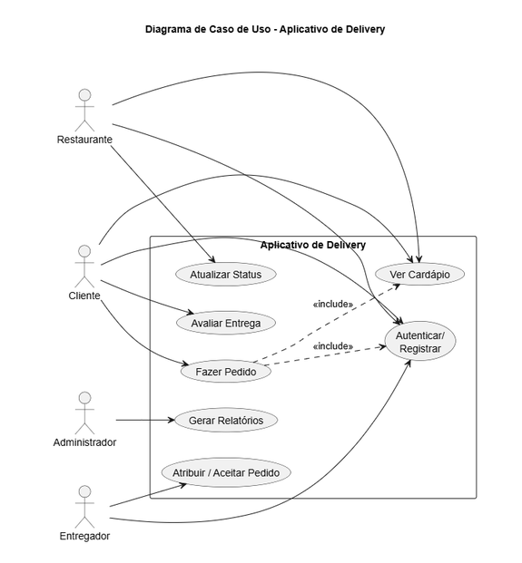
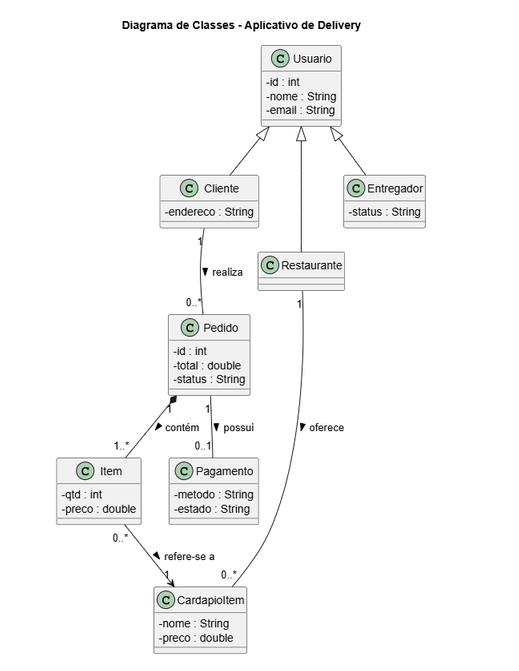
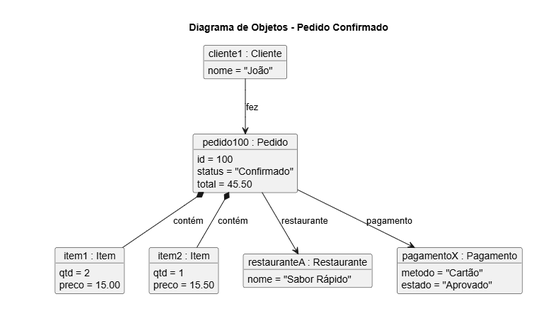
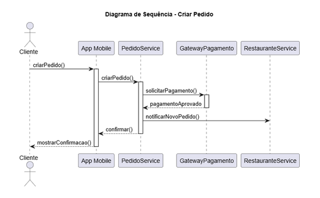
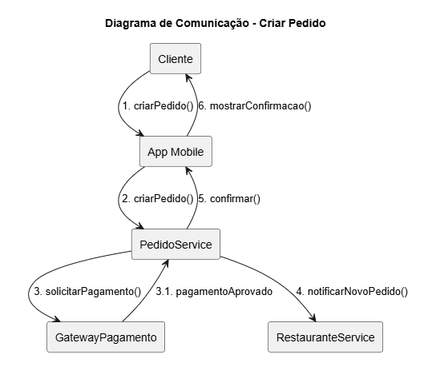
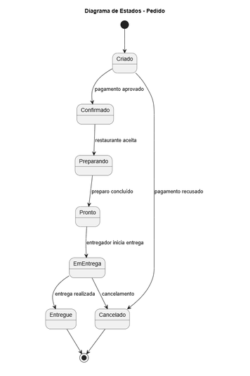
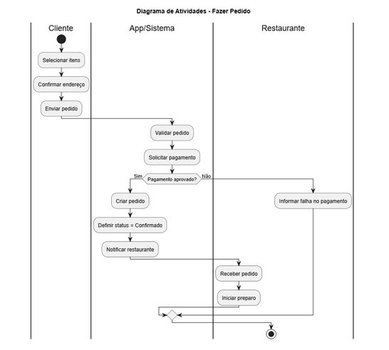

## **Modelagem do Aplicativo de Delivery** 

Tarefa: Implementação os diagramas faltantes (componentes e pacotes)

# **1\. Diagrama de Caso de Uso**

Implemente um diagrama com os seguintes atores:

* Cliente  
* Restaurante  
* Entregador  
* Administrador

E os seguintes casos de uso:

* Autenticar/Registrar  
* Ver Cardápio  
* Fazer Pedido  
* Atualizar Status (Restaurante)  
* Atribuir / Aceitar Pedido (Entregador)  
* Avaliar Entrega  
* Gerar Relatórios

Relações:

* Cliente → Autenticar/Registrar  
* Cliente → Ver Cardápio  
* Cliente → Fazer Pedido  
* Cliente → Avaliar Entrega  
* Restaurante → Autenticar/Registrar  
* Restaurante → Ver Cardápio  
* Restaurante → Atualizar Status  
* Entregador → Autenticar/Registrar  
* Entregador → Atribuir / Aceitar Pedido  
* Administrador → Gerar Relatórios

Relações include:

* Fazer Pedido inclui Ver Cardápio  
* Fazer Pedido inclui Autenticar/Registrar

# **2\. Diagrama de Classes**

Implemente as seguintes classes com seus atributos:

### Classes de Usuário

* Usuario  
  * id  
  * nome  
  * email

* Cliente (herda de Usuario)  
  * endereco

* Restaurante (herda de Usuario)  
  * nome

* Entregador (herda de Usuario)  
  * status

### Outras Classes

* Pedido  
  * id  
  * total  
  * status

* Item  
  * qtd  
  * preco  
  * cardapioItem : CardapioItem

* CardapioItem  
  * nome  
  * preco

* Pagamento  
  * metodo  
  * estado

### Relacionamentos:

* Cliente 1 — 0..\* Pedido  
* Pedido 1 — 1..\* Item (composição)  
* Item — CardapioItem  
* Pedido — Pagamento (0..1)  
* Restaurante — 0..\* CardapioItem

# **3\. Diagrama de Objetos**

Monte um diagrama representando o seguinte cenário: Pedido confirmado

Objetos:

* cliente1:Cliente (nome \= “João”)  
* pedido100:Pedido (id=100, status="Confirmado", total=45.50)  
* item1:Item (qtd=2, preco=15.00)  
* item2:Item (qtd=1, preco=15.50)  
* restauranteA:Restaurante (nome="Sabor Rápido")  
* pagamentoX:Pagamento (metodo="Cartão", estado="Aprovado")

Relacionamentos:

* cliente1 → pedido100 : fez  
* pedido100 \*-- item1 : contém  
* pedido100 \*-- item2 : contém  
* pedido100 → pagamentoX : pagamento  
* pedido100 → restauranteA : restaurante

# **4\. Diagrama de Sequência** 

Criar um diagrama com os seguintes participantes: Criar Pedido e Pagamento Aprovado

* Cliente (ator)  
* App Mobile  
* PedidoService  
* GatewayPagamento  
* RestauranteService

Fluxo:

1. Cliente → App Mobile: criarPedido()  
2. App → PedidoService: criarPedido()  
3. PedidoService → GatewayPagamento: solicitarPagamento()  
4. GatewayPagamento → PedidoService: pagamentoAprovado  
5. PedidoService → RestauranteService: notificarNovoPedido()  
6. PedidoService → App: confirmar()  
7. App → Cliente: mostrarConfirmacao

# **5\. Diagrama de Comunicação**

Mesmos elementos do diagrama de sequência, com mensagens numeradas:

1. Cliente → App: criarPedido  
2. App → PedidoService: criarPedido  
3. PedidoService → Gateway: solicitarPagamento  
    3.1 Gateway → PedidoService: pagamentoAprovado  
4. PedidoService → RestauranteService: notificar  
5. PedidoService → App: confirmar  
6. App → Cliente: mostrarConfirmacao

# **6\. Diagrama de Estados (Entidade Pedido)**

Estados do Pedido:

* Criado  
* Confirmado  
* Preparando  
* Pronto  
* EmEntrega  
* Entregue  
* Cancelado

Transições:

* Criado → Confirmado (pagamento aprovado)  
* Criado → Cancelado (pagamento recusado)  
* Confirmado → Preparando  
* Preparando → Pronto  
* Pronto → EmEntrega  
* EmEntrega → Entregue  
* EmEntrega → Cancelado

# **7\. Diagrama de Atividades**

Swimlanes: Cliente | App/Sistema | Restaurante

Fluxo:

1. Cliente seleciona itens  
2. Cliente confirma o endereço  
3. Cliente envia pedido  
4. Sistema valida pedido  
5. Sistema solicita pagamento  
6. Decisão: pagamento aprovado?  
   * Se sim: criar pedido confirmado  
   * Se não: informar falha e encerrar  
7. Restaurante recebe a notificação  
8. Restaurante inicia preparo

# **8\. Diagrama de Componentes**

Componentes:

* App Mobile (cliente)  
* API REST (servidor)  
* Pedido Service  (servidor)  
* Auth Service  (servidor)  
* Notificação Service  (servidor)  
* Banco de Dados  (servidor)  
* Gateway Pagamento (externo)  
* Serviço de Mapas (externo)

Conexões:

* App Mobile → API REST  
* API REST → Pedido Service  
* Pedido Service → Banco de Dados  
* Pedido Service → Notificação Service  
* Pedido Service → Gateway Pagamento  
* Pedido Service → Serviço de Mapas

# **9\. Diagrama de Pacotes**

## Pacotes:

* ui  
   *Conteúdo:* App / Web (telas, interface com o usuário)  
* domain  
   *Conteúdo:* Entidades de negócio  
  * Pedido  
  * Usuario  
  * Item  
  * CardapioItem

* service  
   *Conteúdo:* Serviços e regras de negócio  
  * PedidoService  
  * PagamentoService  
  * NotificacaoService

* infra  
   *Conteúdo:* Infraestrutura e integrações externas  
  * Banco de Dados (DB)  
  * GatewayPagamento  
  * Serviço de Mapas

## Dependências:

* ui → service  
   A interface chama os serviços para executar operações.  
* service → domain  
   Os serviços manipulam as entidades do sistema.  
* service → infra  
   Os serviços usam infraestrutura: banco, pagamento e mapas.

# **10\. Diagrama de Implantação**

Nós:

* Smartphone (executa “App Mobile”)  
* Servidor de Aplicação (executa “API REST” e “PedidoService”)  
* Servidor de Banco (executa “Banco de Dados”)  
* Serviços Externos (Gateway Pagamento, Serviço de Mapas, Serviço de Notificação)

Conexões:

* Smartphone → Servidor de Aplicação (HTTPS)  
* Aplicação → Banco de Dados (TCP/SQL)  
* Aplicação → Serviços Externos (HTTPS)
