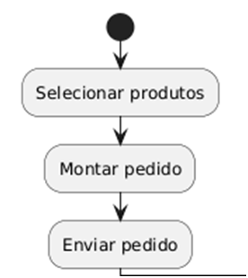
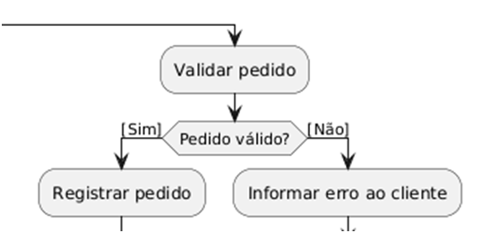
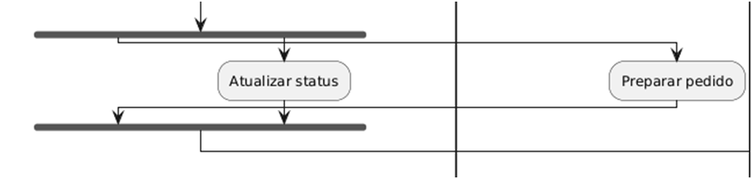
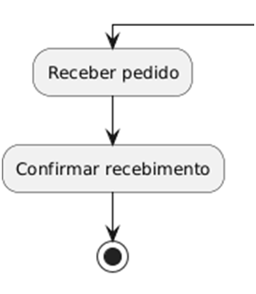
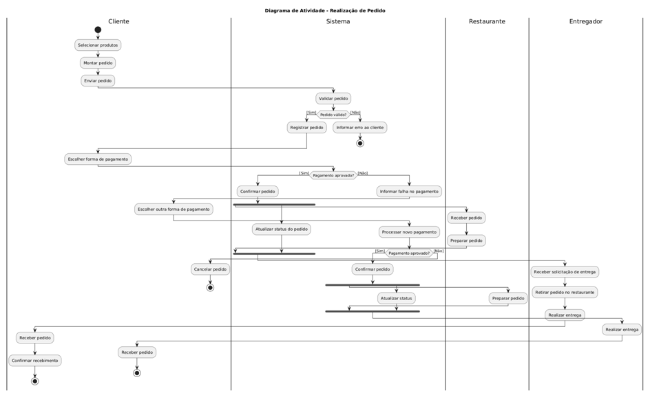

# **Diagrama de Atividades:**

## **Elementos:**

**NÓ INICIAL:**  
Indica o ponto de partida do processo, representado por um círculo preenchido

**ATIVIDADE:**  
Indica uma tarefa/operação, representado por um retângulo com as cantos arredondados

**FLUXO:**  
Mostra a sequência das atividades, representado por setas entre as atividades

**DECISÃO:**  
Divide o fluxo conforme uma condição ou une dois fluxo que já haviam sido divididos por uma decisão, representado por um losango, ou um retângulo com as bordas triangulares

**GUARDA:**  
Expressa a regra da condição nas setas do fluxo

**FORK:**  
Divide o fluxo em mais de um fluxo(paralelismo), representado por um barra

**JOIN:**  
Une dois ou mais fluxo em um só, representado por uma barra  

**NÓ FINAL:**  
Indica o ponto de término do processo, representado por um círculo com círculo em volta

**RAIA:**  
Separa as responsabilidades, representado por colunas ou faixas nomeadas

