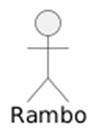
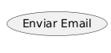
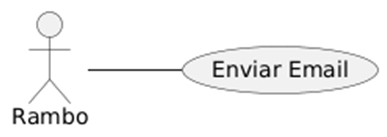
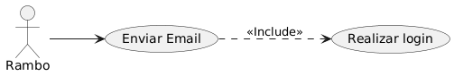
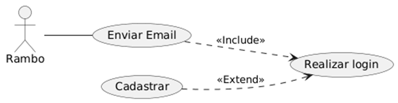
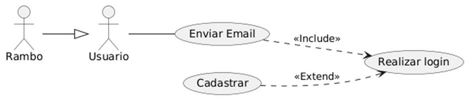

# **Diagrama de Caso de Uso:**

## **Elementos:**

**ATOR:** quem interage com o sistema  

**CASO DE USO:** funcionalidade que será usada pelo ator  

**RETÂNGULO:** representa o sistema, ou seja todas os casos de uso ficam dentro dele

## **Relacionamentos:**

**Associação simples:**  

**\<\<INCLUDE\>\>:**  
Indica um caso de uso que SEMPRE utiliza outro  
**A seta aponta para o caso de uso incluído(caso-pai → caso-filho)**  

**\<\<EXTEND\>\>**  
Indica um caso opcional ou condicional  
**A seta aponta para o todo(caso-opcional → caso-principal)**  

**herança:** 
Indica uma herança entre os atores  
**A seta aponta para o todo(ator-filho→ ator-pai)**  

