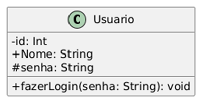
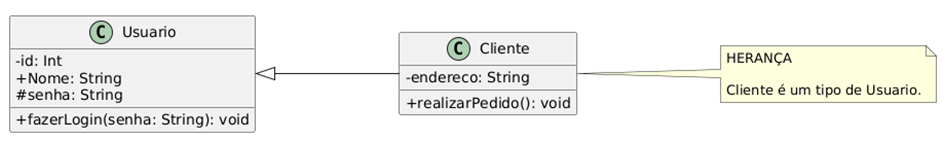
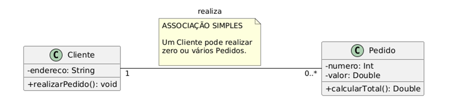
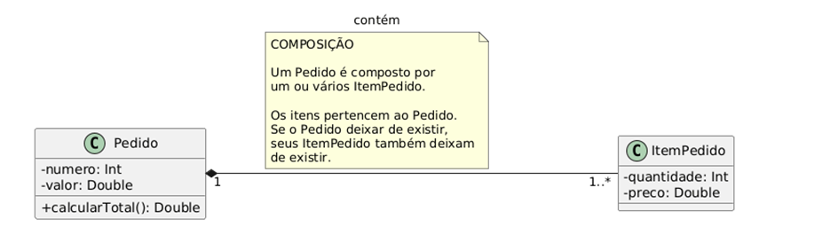
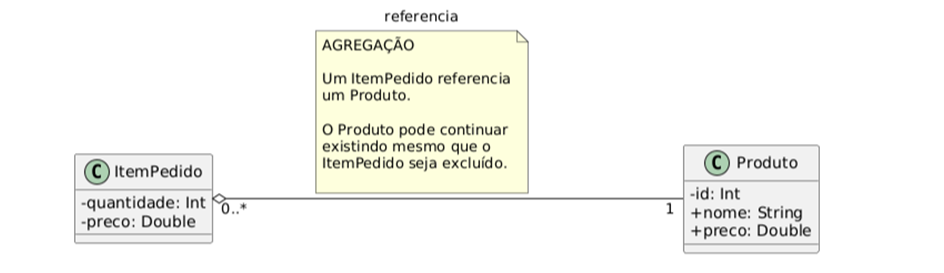
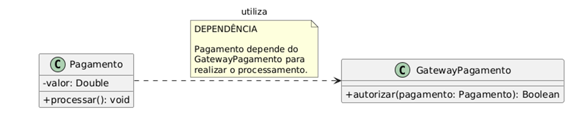

# **Diagrama de Classes:**

## **Elementos:**

**CLASSE:**  
**ATRIBUTOS:**  
**(-):** atributo privado, ou seja, apenas a classe pode acessar  
**(+):** atributo público, ou seja, todos podem acessar  
**(\#):** atributo protegido, ou seja, apenas a classe e suas subclasses podem acessar  
FORMATO: tipoAcesso nome\_atributo: tipoAtributo

**MÉTODOS:**  
FORMATO: nome\_do\_metodo(nome\_atributo: tipoAtributo): tipoRetorno  

Tipos de classe presentes: 

* **Enum:** define um conjunto fixo de valores.  
* **Abstract:** não pode ser instanciado diretamente e serve apenas como base.  
* **Interface:** define um conjunto de operações(métodos) públicas.

## **Multiplicidade:**

Indica quantas instâncias de uma classe podem se relacionar com outra.

| Notação | Significado |
| :---- | :---- |
| 1 | Exatamente um |
| 0..1 | Zero ou um |
| \* | Muitos |
| 0..\* | Zero ou muitos |
| 1..\* | Um ou muitos |
| m..n | Intervalo específico |

## **Relacionamentos:**

**Herança:**  
Uma classe especializada herda características da classe mais geral.   

**Associação simples:**  
Indica um relacionamento entre duas classes  

**Composição:**  
As partes dependem da existência do todo, ou seja, não podem existir independentemente.  
**O losango preenchido fica do lado do "todo"(classe que contém a parte).**   

**Agregação:**  
Representa uma relação "todo-parte", em que as partes podem existir independentemente do todo.  
**O losango vazio fica do lado do "todo"(classe que contém a parte) .**   

**Dependência:**   
uma classe utiliza outra para realizar alguma operação, mas não necessariamente mantém uma relação estrutural permanente   
A seta com linha tracejada aponta para a classe incluída.

