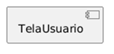
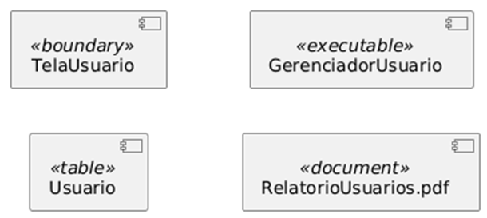
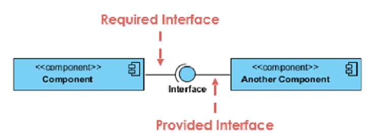
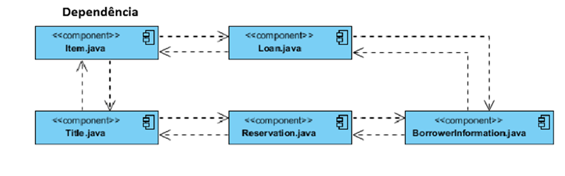
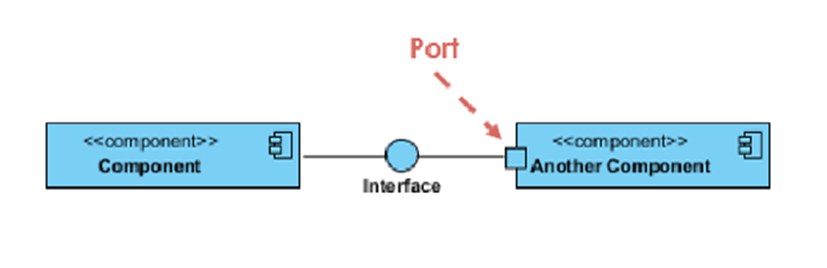
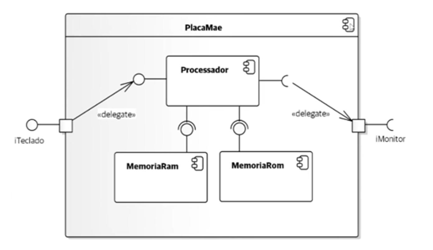

# **Diagrama de Componentes:**

## **Elementos:**

**COMPONENTE:** unidade autônoma dentro de um sistema, responsável por implementar um conjunto de funcionalidades  

## **Estereótipos:**

Indicam características específicas de um componente  
Alguns exemplos:  
\<\<executable\>\>: arquivo executável  
\<\<library\>\>: biblioteca  
\<\<table\>\>: tabela de banco de dados  
\<\<boundary\>\>: interface de comunicação  
\<\<document\>\>: documento associado  
\<\<file\>\>: arquivo físico no sistema  

## **Relacionamentos:**

**Interfaces:** Define os métodos que um componente disponibiliza para outros componentes.

* **Interfaces fornecidas(provided):** é o serviço que o componente oferece   
  Representada por um “pirulito”  
    
* **Interfaces requeridas(required):** é o serviço que o componente precisa   
  Representada por um meio círculo fino(também chamado de soquete)

**Dependências:** setas tracejadas, indicam elementos que necessitam de outros.  

**Portas:** pontos de comunicação entre o componente e o ambiente externo

## **Componentes Internos:**

Um componente pode ter dentro dele outros componentes ou classes

**Caixa Preta:** Mostra apenas as interfaces(oculta as classes)

**Caixa Branca**: Mostra as classes internas  

