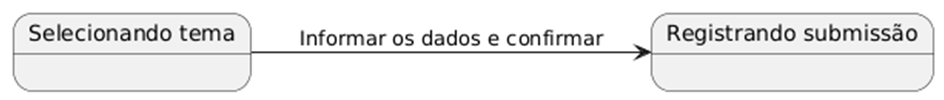
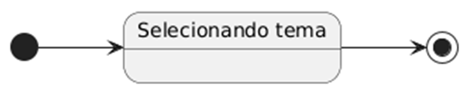
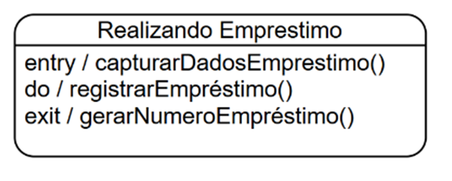
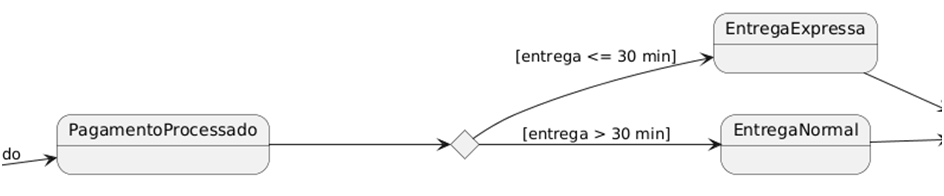
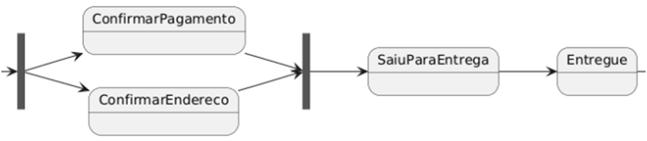

# **Diagrama de Máquina de Estado:**

## **Elementos:**

**Estado:** retângulo arredondado, representa uma situação em que um objeto pode estar

**Evento:** Algo que acontece e provoca a mudança de estado

**Transição:** seta entre estados, indica a passagem de um estado para outro

**Estado Inicial e Final:** ponto de partida(círculo preenchido) e ponto de término(círculo com contorno).

## **Detalhamento:**

**Entry:** Ação executada imediatamente uma única vez ao entrar no estado   
**Do:** atividade em andamento enquanto o objeto permanece no estado  
**Exit:** ação executada ao sair do estado  

## **Pseudoestado:**

**Escolha\<\<choice\>\>:** representa um ponto de transição em que se deve tomar uma decisão.  
**Indicado por um losango, que divide o fluxo em duas escolhas**  

**Paralelismo: \<\<fork\>\> & \<\<join\>\>:** unir múltiplos fluxos em um único ou dividir um fluxo em diversos, respectivamente.  
Indicado por uma barra preenchida ou um círculo preenchido  

