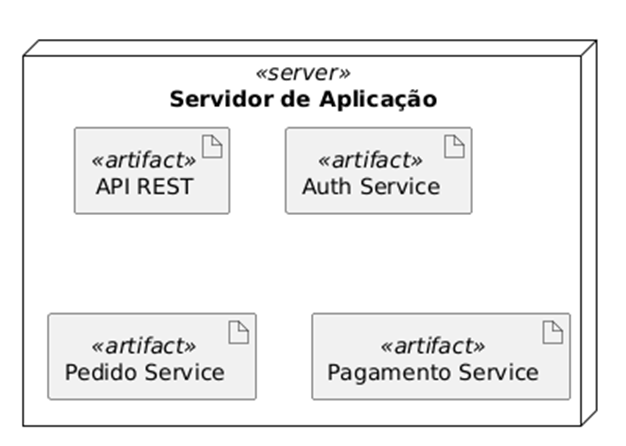

# **Diagrama de Implantação:**

## **Elementos:**

**NÓ(NODE):**  
Indica um dispositivo ou ambiente físico, representado por um cubo 3D.

**ARTEFATO:**  
Indica um elemento físico do software, representado por um retângulo.

**ESTEREÓTIPO:**  
Indica os tipos dos dispositivos

## **Dependências**:

Indica conexões entre os nós ou entre os artefatos

