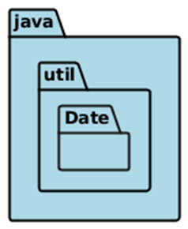
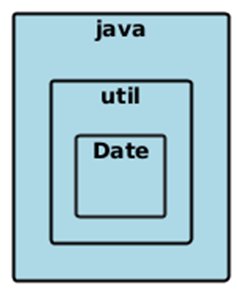
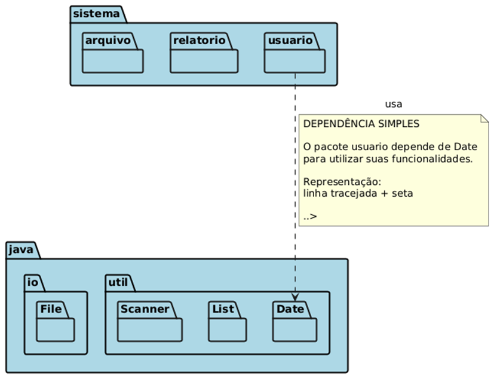
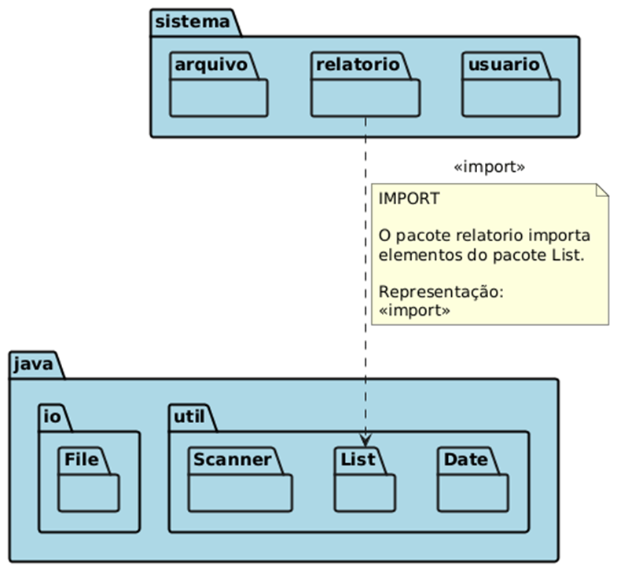
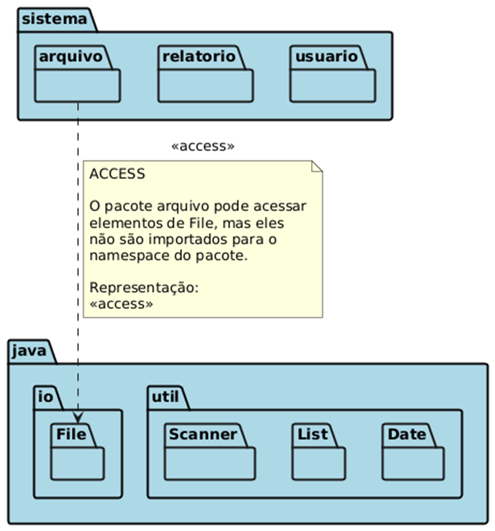

# **Diagrama de Pacotes:**

## **Elementos:**

**PACOTE:** representado pelo retângulo com uma pequena aba, lembrando uma pasta de arquivos  
Exemplos de formatos  

## **Dependências:**

As dependências simples são representadas por setas tracejadas, indicando que um pacote depende de outro.  

**\<\<IMPORT\>\>**  
Indica que um pacote importa os elementos de outro  

**\<\<ACCESS\>\>**  
Indica que um pacote requer acesso a outro pacote  

