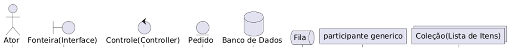
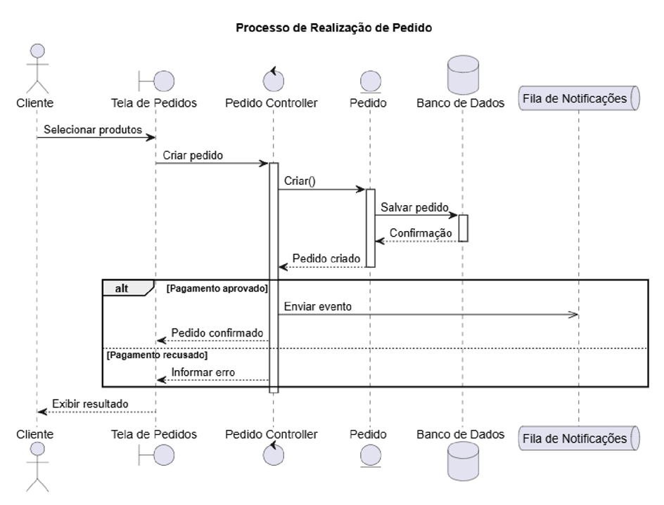

# **Diagrama de Sequência:**

## **Elementos:**

**PARTICIPANTE:** Objeto ou componente genérico  
**ATOR:** Usuário ou sistema externo  
**FRONTEIRA:** Interface entre o sistema e agentes externos  
**CONTROLE:** Coordenação logia ou fluxo  
**ENTIDADE:** Objeto do domínio  
**BANCO DE DADOS:** Persistência de dados  
**COLEÇÃO:** Conjunto de objetos  
**FILA:** Processo assíncrono

**Linha de vida:**  
**Linha vertical** tracejada que parte do objeto.  
Representa a existência do objeto ao longo do tempo.

**Ativações:**  
Retângulos finos sobre a linha a linha de vida.  
Indica o tempo em que o objeto está “ativo”.

**Mensagens:**  
**Setas horizontais** entre as linhas de vida dos objetos

* **Síncrona:** linha contínua com seta cheia.  
* **Assíncrona:** linha contínua com seta aberta.  
* **Retorno:** linha tracejada com seta aberta

